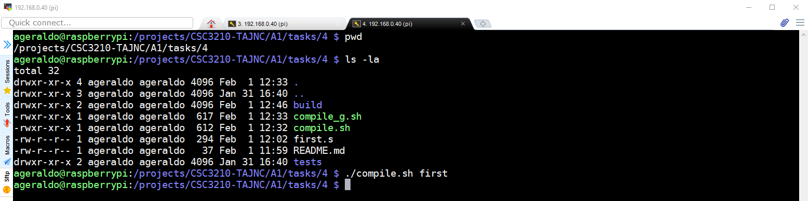
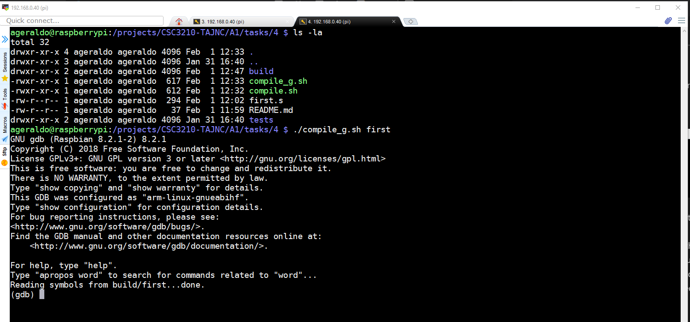
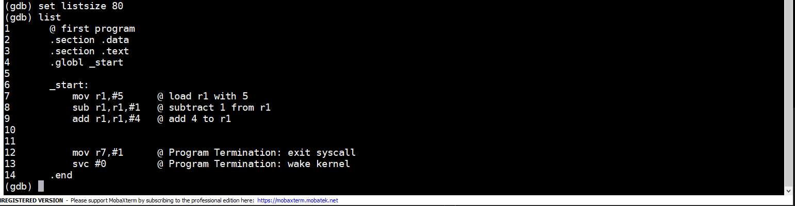
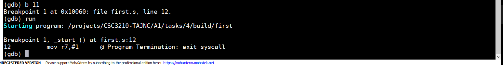
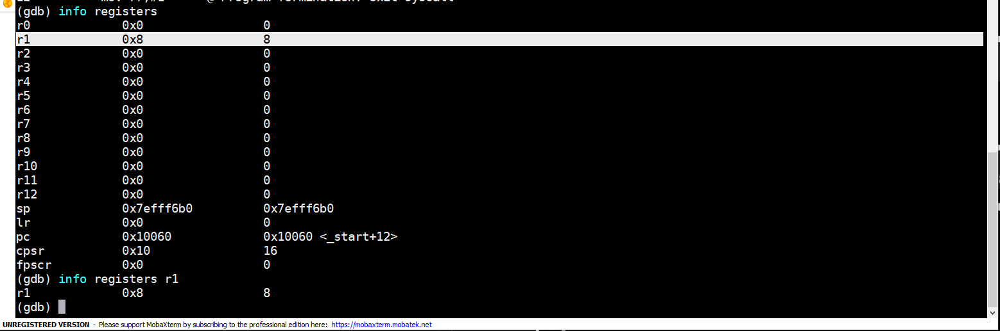
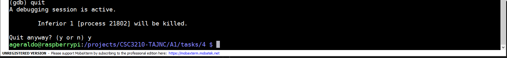
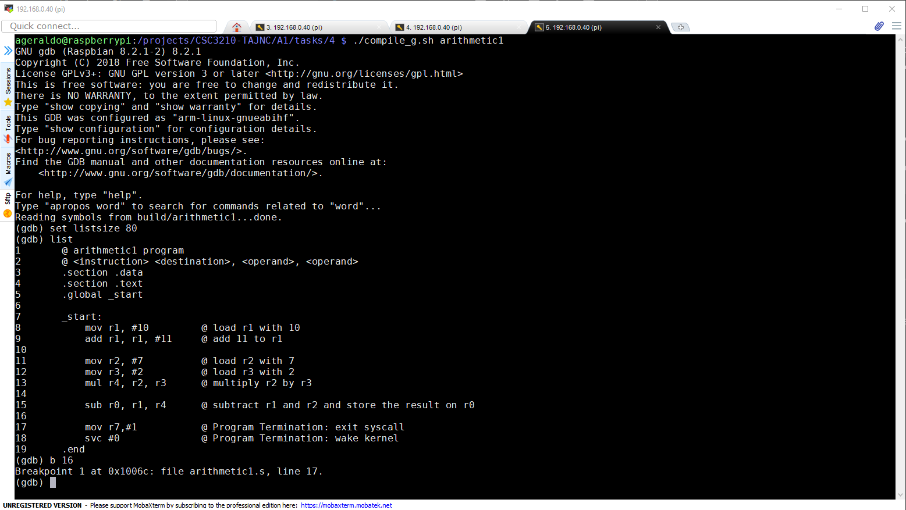
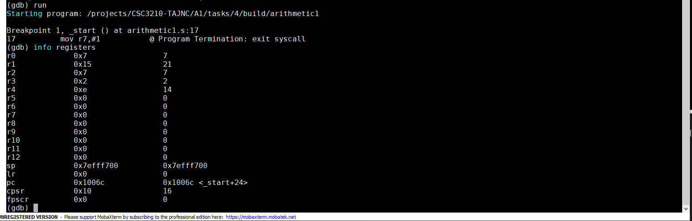
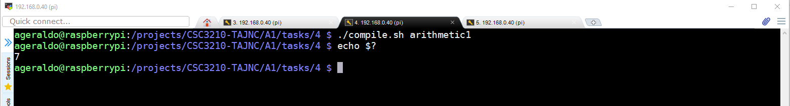

## **ARM assembler in Raspberry Pi**
___

### Part One - First Program
_____
+ Created a program called [first.s](first.s).

+ Created a shell script to compile, link and execute the program : [compile_sh](compile.sh).

+ Output

+ [first.s](first.s) program moves a number five for the register r1, subtract one, add 4, and store the result of the operation (which is eight) on register r1.
    No output is expected during the execution of this program. The reason why is because the program is manipulating with the CPU register only. There is no code implemented to produce any output to the screen. A different approach must be used to examine what operations the program is performing.  

+ Created a shell script to compile, link and execute the program in debug mode using GNU Debugger : [compile_g.sh](compile_g.sh).
    
+ Output

+ Listing the source inside of GNU Debugger

+ Adding a breaking on line 11 and running the program : 

+ Examinating CPU registers (expected result for R1 register is the decimal number 8) : 

+ Expected result confirmed. Exiting from GNU debugger.

### Part Two - Arithmetic Program
_____
+ Created a program called [arithmetic1.s](arithmetic1.s).

+ Running the program in debug mode using GNU Debugger :

+ Examinating CPU registers (expected result for R0 register is the decimal number 7) :

+ Expected result confirmed. Exiting from GNU debugger.

+ Since we used R0 register to store the result of the operation, we can also retrieve the value of R0 by inspecting the system code returned by the application: 

   