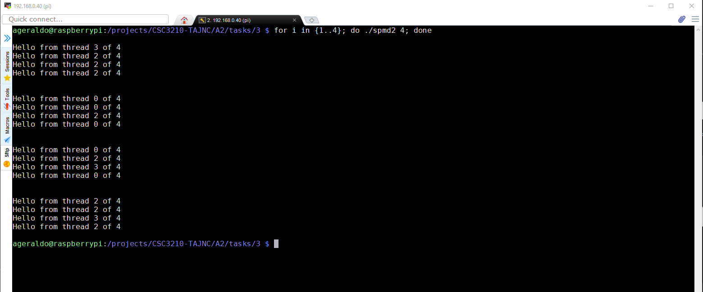

## **Parallel Programming Skills**
**URL :** https://csinparallel.org/index.html
____

### **Part1**
___

+ Identifying the components on the raspberry PI B+
    + Motherboard    : Single Board Computer (SBC)
    + Microprocessor : Quad-Core Multicore CPI
    + Memory (RAM)   : 1GB
    + I/O Devices    : Ethernet, USB, HDMI, Camera

+ How many cores does the Raspberry Pi’s B+ CPU have
    + The Raspberry Pi’s B+ CPU has 4 cores.

+ List three main differences between X86 (CISC) and ARM Raspberry PI (RISC). Justify you answer and use your own words.
    + CISC
        + Provides a larger and complex instructions set.
        + Reduced numbers of register compared to the ARM architecture.
        + Instruction set architecture implements a register–memory architecture.
        + Implement Von Neumann architecture design.

    + RISC
        + Provides a reduced and simpler instructions set.
        + Reduced instruction requires simpler circuits resulting in the other hand, more physical space for the chip. 
        + Instruction set architecture implements a register–register architecture.
        + Implement Harvard architecture design.

+ What is the difference between sequential and parallel computation and identify the practical significance of each?
    + Sequential computations is a computation that is executed in series or sequentially. It means the computation completes the cycle from start to end without other processing executing. The parallel computation which is the opposite of sequential computation performs the calculation of the process simultaneously. For instance, if a process can be divided into smaller ones (multi-threading), all of this new sub-process can be executed at the same time (parallel computing) in order to solve the main calculation. 

+ Identify the basic form of data and task parallelism in computational problems.
    + Task : Incorporates the execution of computer process (or threads) across multiple processors. The main goal is to execute different operations in parallel to utilize the available computing resources in form of processors and memory.

    + Data : Incorporates on distribution of data sets across the multiple computation programs. In this form, same operations are performed on different parallel computing processors on the distributed data sub set.

+ Explain the differences between processes and threads.
    + Process
        + An instance of a program execution. 
        + A process consist of one or multiple threads.
        + Memory allocated is not shared accross the process.
        + Resources intensive.

    + Thread
        + Its a subset of the process.
        + Light weight (lesser resources intensive).
        + Threads interact through reads/writes to a shared address space.
        + Minimize the context switching time.

+ What is OpenMP and what is OpenMP pragmas?
   + OpenMP is an application programming interface (API) that provides a multi-threading, shared model for applications. The #pragma is a compiler-specific directive. In OpenMP, pragmas are used to instanciate OpenMP objects or to control how the program works.

+ What applications benefit from multi-core (list four)?
    + Application performance improvements.
    + 

+ Why Multicore? (why not single core, list four)
    + Cost reduction.
    + Performance improvement.
    + Tremendous power savings.
    + CPU clock speed cannot be higher than the speed of light. (clock speed is limited)
    

### **Part2**
_____

+ Created a program called [spmd2.c](spmd2.c) 

+ Compiled and linked the program   
    

+ Program execution
    + 4 threads
    

    + 1 thread
    

    + 8 threads
    

+ Repeating the execution with four threads
    

    **Issue:**
    + Thread ID numbers are not unique. The variable used to store the thread id number was declared outside of the parallel scope causing a shared data issue (more than one thread changing the value of a shared variable).     
    

+ Fixing the code
    

+ Compiled and linked the program   
    

+ Repeating the execution with four threads
    

    

