## **ARM assembler in Raspberry Pi**
___

### Part One - Second program
___

+ Created a program called [second.s](second.s).

+ Compile the source code
    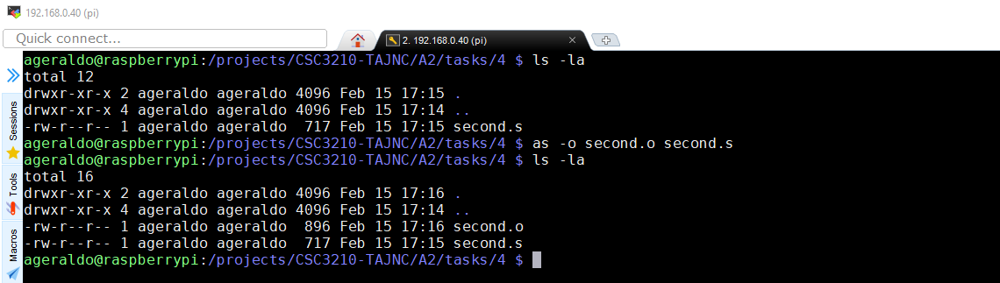

+ Link the object file
    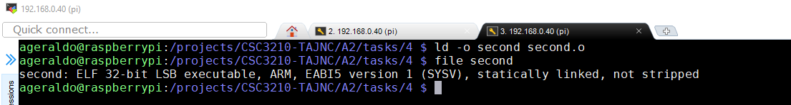

+ Execute the program
    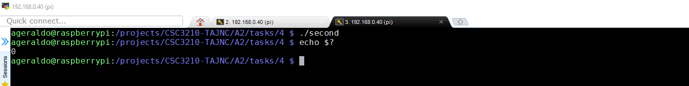

     No output is expected during the execution of this program. The reason why is because the program is manipulating with the CPU register and memory address only. There is no code implemented to produce any output to the screen. A different approach must be used to examine what operations the program is performing.

+ Assemblying generating debugging information (-g flag)
    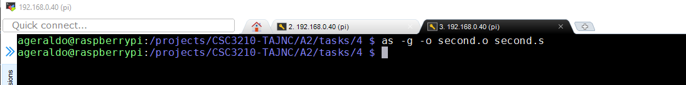

+ Link the object file
    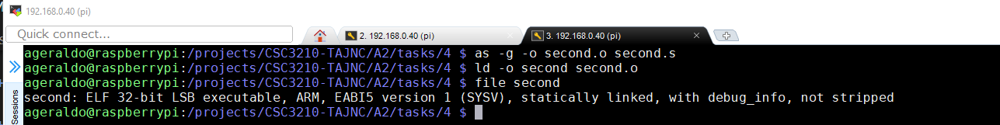

+ Invoke GNU Debugger
    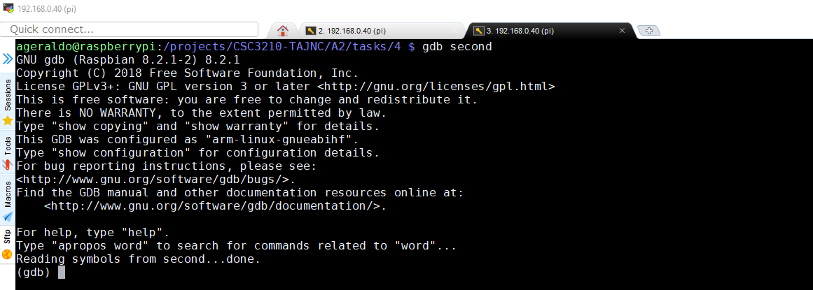

+ Adjust the list size and print the source code of the program
    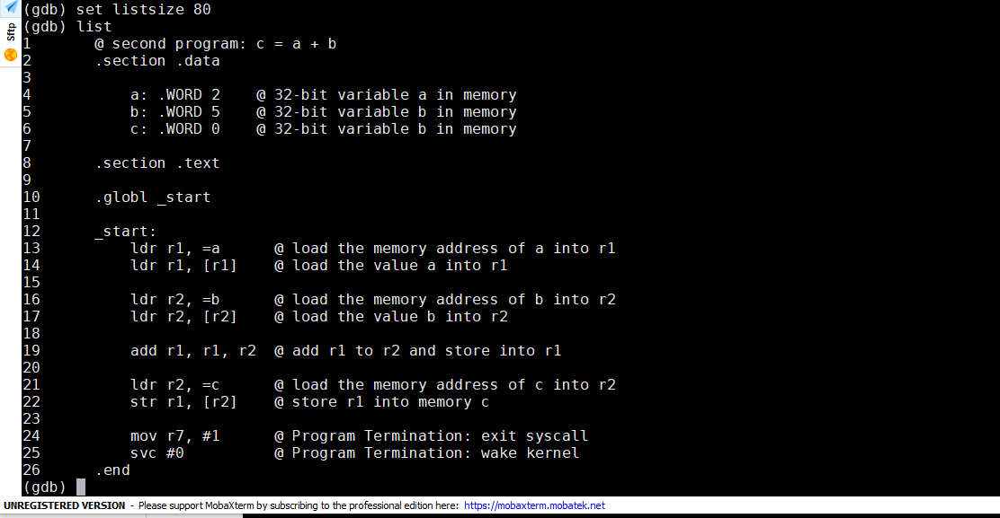

+ Add a breaking on line 22 and execute the program
    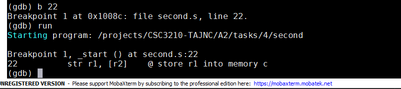

+ Retrieve the memory address for a, b and c variables
    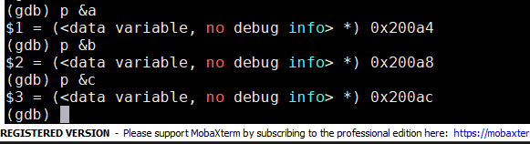

+ Examine the values of a, b and c before line 22 (store instruction)
    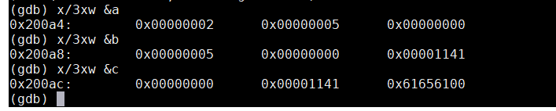

    + a = 0x2 (2d)
    + b = 0x5 (5d)
    + c = 0x0 (0d)

+ Step through one instruction and re-examine the value of c again
    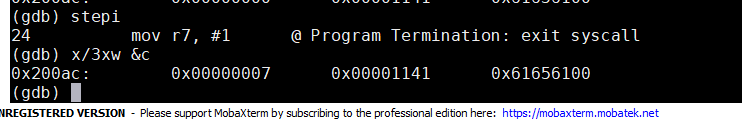
    + As expected, the value of C was changed from zero to 0x7 (7d). The value is the result of the additional of A and B variables. 

+ Inspect also the values of R1 and R2 register 
    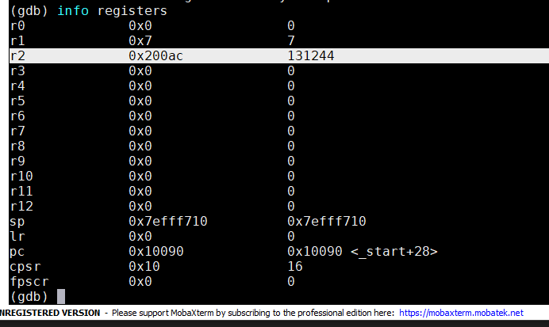
    
    + R1 = 0x7 (7d)
    + R2 = 0x200ac (memory address of C variable)

### Part Two - Second program
___

+ Created a program called [arithmetic2.s](arithmetic2.s).

+ Assemblying generating debugging information (-g flag) and linking the object file
    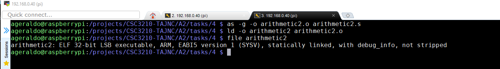

+ Invoke GNU Debugger, adjust the list size, print the source
    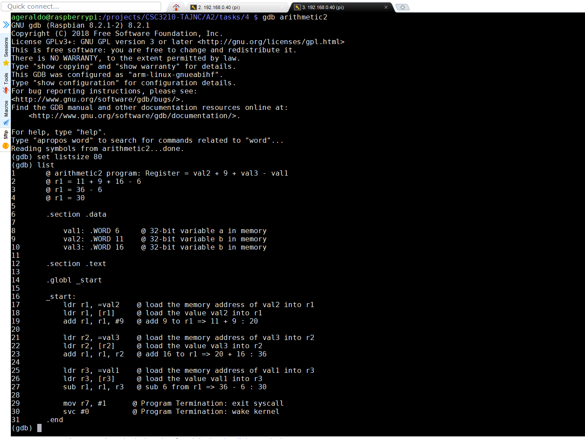

+ Add a breaking on line 29 and execute the program
    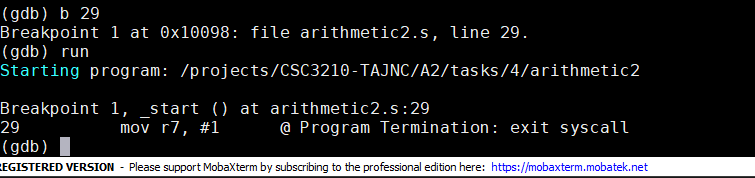

+ Examine the values of val1, val2 and val2
    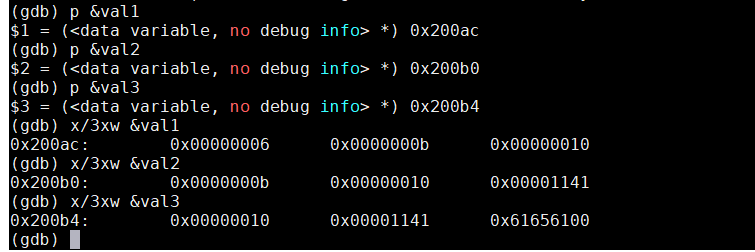

    + val1 = 0x6 (6d)
    + val2 = 0xb (11d)
    + val3 = 0x10 (16d)

+ Inspect the value of R1 rgister to confirm the result of the computation
    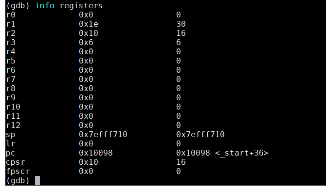

    + r1 =>  11 + 9 + 16 - 6 = 30d (0x1e)

