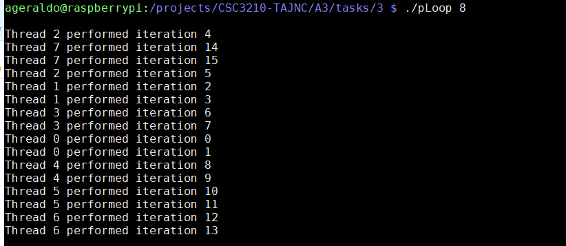

## **Parallel Programming Skills**
### Serial Computing
____


### **Part1**
___
+ Define the following: Task, Pipelining, Shared Memory, Communications, Synchronization.

+ Classify parallel computers based on Flynn's taxonomy. Briefly describe every one of them.

+ What are the Parallel Programming Models?

+ List and briefly describe the types of Parallel Computer Memory Architectures. What type is used by OpenMP and why?

+ Compare Shared Memory Model with Threads Model?

+ What is Parallel Programming?

+ What is system on chip (SoC)? Does Raspberry PI use system on SoC?

+ Explain what the advantages are of having a System on a Chip rather than separate CPU, GPU and RAM components.

### **Part2**
_____

+ #### 2.1 Observe the code

    + **#pragma omp parallel for :** The omp for directive instructs the compiler to distribute loop iterations within the team of threads that encounters this work-sharing construct.

    + Created a program parallelLoopEqualChunks.c [parallelLoopEqualChunks.c](parallelLoopEqualChunks.c) 

    + Compiled and linked the program
    

    + Program execution
    

    + Using a higher number of threads
        + 8 threads
        

        + 16 threads
        

        + 32 threads
        

        **Note:** As the number total of threads is higher than the number maximum of cores available, the parallel execution of the threads decrease.

    + Using number of threads not divisible by 4
        + 1 thread
        
        
        + 2 threads
        

        + 3 threads
        

        + 5 threads
        

        **Note:** As we increase the number of threads (1-4), becomes easier the see the workload across the cores.

+ #### 3.3 Another way to divide the work

    + **#pragma omp parallel for schedule(static,1) :** Divide the loop into equal-sized chunks or as equal as possible in the case where the number of loop iterations is not evenly divisible by the number of threads multiplied by the chunk size. By default, chunk size is loop_count/number_of_threads.Set chunk to 1 to interleave the iterations.

    + Created a program parallelLoopChunksOf1.c
    [parallelLoopChunksOf1.c](parallelLoopChunksOf1.c) 

    + Compiled and linked the program
    

    + Program execution
    

    + Using a different number of threads in order to illustrate how schedule directive works.
        

    **Note:** Thread zero is performing the iteration of even numbers and Thread one is performing the iteration of odd numbers.

+ #### 4.1 When loops have dependencies
    + Created a program reduction.c
    [reduction.c](reduction.c) 

    + Compiled and linked the program
    

    + Executing without removing the comment on line 39
        ```c        
        int parallelSum(int* a, int n) {
            
            int sum = 0;
            int i;

            // #pragma omp parallel for // reduction(+:sum)

            for (i = 0; i < n; i++) {
                sum += a[i];
            }

            return sum;
        }
        ```

        + Program execution
        

        + Program execution using different number of threads
        


    + Executing after removing the first comment on line 39
        ```c        
        int parallelSum(int* a, int n) {
            
            int sum = 0;
            int i;

            #pragma omp parallel for // reduction(+:sum)

            for (i = 0; i < n; i++) {
                sum += a[i];
            }

            return sum;
        }
        ```

        + Program execution
        

        **Note:** The sequential sum as parallel sum numbers does not match. The parallel sum also is computing different numbers for each execution.        


    + Executing after removing the second comment on line 39
        ```c        
        int parallelSum(int* a, int n) {
            
            int sum = 0;
            int i;

            #pragma omp parallel for reduction(+:sum)

            for (i = 0; i < n; i++) {
                sum += a[i];
            }

            return sum;
        }
        ```

        + Program execution
        

        **Note:** The directive reduction(+:sum) solved the shared memory issue. The sequencial and the parallel sum number matches.    

