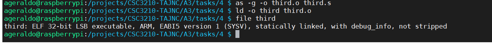

## **ARM assembler in Raspberry Pi**
___

### Part One - Third program
___

+ Created a program called [third.s](third.s).

+ Compiling the source code
    

+ Fixing the code (invalid datatype .shalfword)
```c
    .section .data
        a: .short -2    @ 16-bit signed integer
```

+ Compiling the source code again
    

+ Invoking GNU Debugger
    

+ Adding a breaking on line 7 and executing the program
    


+ Examining register and memory information before execution
    

    + 0xFFFE = (-2d)

+ Examining register and memory information after execution of line 16
    


### Part Two - Second program
___

+ Created a program called [arithmetic3.s](arithmetic3.s).

+ Assemblying generating debugging information (-g flag) and linking the object file
    


+ Invoking GNU Debugger
    
    
    


+ Adding a breaking point on line 22 and executing the program
    


+ Examining register and memory information
    

    + val1 = (0xC4) (-60d)
    + val2 = (0x0B) (11d) 
    + val3 = (0x10) (16d)

+ Examining register and memory information after execution of line 31
    

    ```
    r1 : 0xE2 (ignoring all F from the left to make the math easier)						  

        0xE2 =  1110 0010
                |
                +-------- msb = 1 (negative)

    Using Two's complement to discover the right number representation:
    
    a) number  :    1110 0010
    
    b) flip    :    0001 1101
    c) add one : +  0000 0001
                    -----------
    d) sum     :    0001 1110   (30d)
    
    Thus, 1110 0010 is the negative representation of -30d.
    ```
+ Examining CPSR register
    


