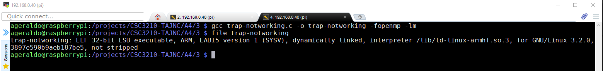
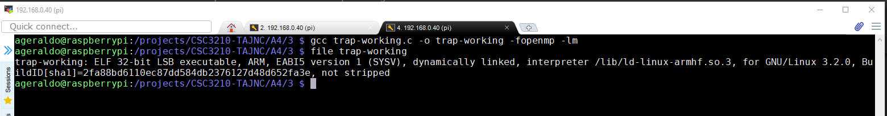
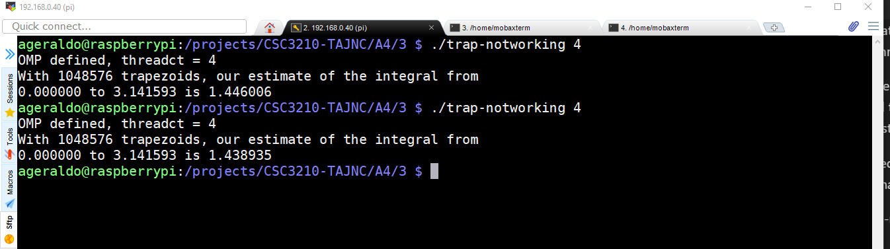
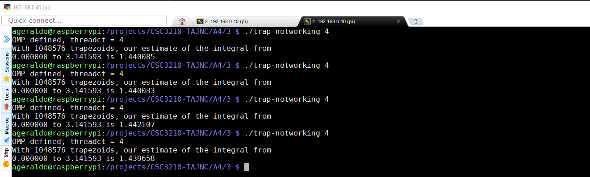
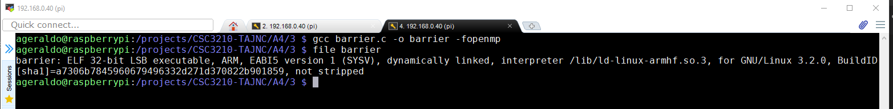
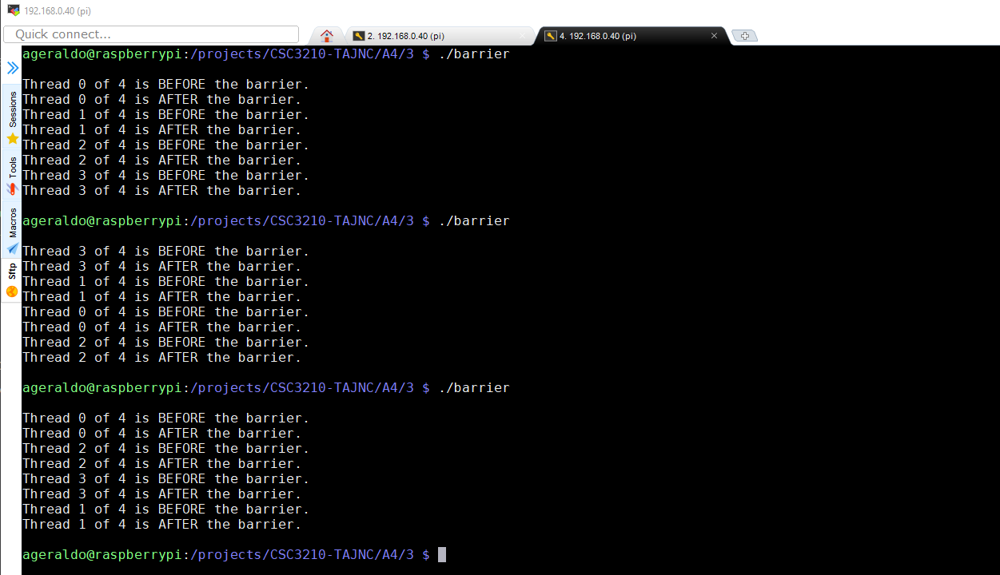
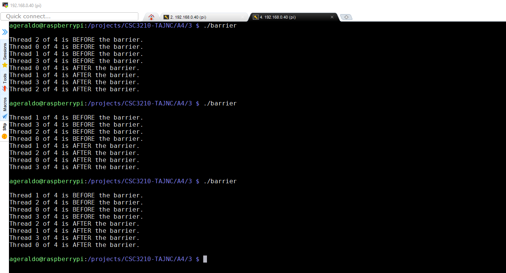
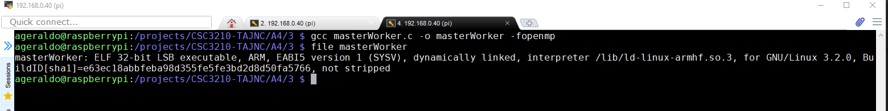
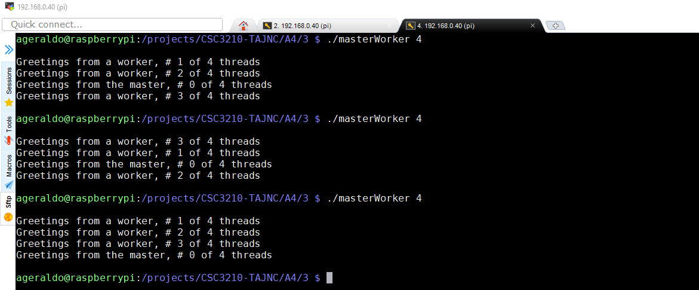

## **Parallel Programming Skills**
### Parallel Programming Patterns
____

### **Part1**
___

+ What is race condition?

+ Why race condition is difficult to reproduce and debug?

+ How can it be fixed? Provide an example from your Project_A3 (see spmd2.c)

+ Summaries the Parallel Programming Patterns section in the “Introduction to Parallel Computing_3.pdf” (two pages) in your own words (one paragraph, no more than 150
words).

+ In the section “Categorizing Patterns” in the “Introduction to Parallel Computing_3.pdf” compare the following:

    + Collective synchronization (barrier) with Collective communication (reduction)

    + Master-worker with fork join

+ Dependency: Using your own words and explanation, answer the following:

    + Where can we find parallelism in programming?

    + What is dependency and what are its types (provide one example for each)?

    + When a statement is dependent and when it is independent (Provide two examples)?

    + When can two statements be executed in parallel?

    + How can dependency be removed?

    + How do we compute dependency for the following two loops and what type/s of dependency?

    ```c
    for (i=0; i<100; i++) {        
        a[i] = i;   // statement 1
    }
    ```

    ```c
    for (i=0; i<100; i++) {
        a[i] = i;     // statement 1
        b[i] = 2*i;   // statement 2
    }
    ```


### **Part2**
___
+ **2.0 INTEGRATION USING THE TRAPEZOIDAL RULE**
    + **#pragma omp parallel for private(i) shared (a, n, h, integral)**
    + **#pragma omp parallel for private(i) shared (a, n, h) reduction(+: integral)** 
        + Variables can have either shared or private context in a parallel environment. Variables in shared context are visible to all threads running in associated parallel regions. Variables in private context are hidden from other threads. Each thread has its own private copy of the variable, and modifications made by a thread to its copy are not visible to other threads.

        + private : The private clause declares the variables in the list to be private to each thread in a team.

        + shared : The shared clause declares the variables in the list to be shared among all the threads in a team. All threads within a team access the same storage area for shared variables.

        + reduction : The reduction clause performs a reduction on the scalar variables that appear in the list, with a specified operator.     


    + Created a program trap-notworking.c [trap-notworking.c](trap-notworking.c).

    + Compiled and linked the program.
    

    + Created a program trap-working.c [trap-working.c](trap-working.c).

    + Compiled and linked the program.
    

    + Program execution
    

    + Running trap-notworking four times to emphasize the issue:
    

    **Note:**
        + The clause ***reduction(+: integral)*** solved the shared memory issue. The OpenMP reduction clause lets you specify one or more thread-private variables that are subject to a reduction operation at the end of the parallel region.


+ **3.0 Coordination: Synchronization with a Barrier**
    + **#pragma omp barrier :** The omp barrier directive identifies a synchronization point at which threads in a parallel region will wait until all other threads in that section reach the same point. Statement execution past the omp barrier point then continues in parallel.

    + Created a program barrier.c [barrier.c](barrier.c).

    + Compiled and linked the program.
    

     + Program execution (without barrier directive - line 33)
     ```c
     // #pragma omp barrier
     ```
    
    **Note:** The output of the printf statement can be observed during the parallel execution. The program output the words "BEFORE" and "AFTER" in sequential order for each thread (4 threads).

     + Program execution (with barrier directive - line 33)
     ```c
      #pragma omp barrier
     ```

    
    **Note:** Differently from the first execution, we can observe that all threads only execute the second printf statement (print "AFTER") only after all threads reach the barrier.

+ **4.0 Program Structure: The Master-Worker Implementation Strategy**
    + Created a program masterWorker.c [masterWorker.c](masterWorker.c).

    + Compiled and linked the program.
    

     + Program execution (without parallel directive - line 25)
     ```c
     // #pragma omp parallel
     ```
     
     **Note:** Only the result of if statement is executed by the programa (printf("Greetings from the master, # %d of %d threads\n",id, numThreads)). It means that thread id is always zero.

     + Program execution (with parallel directive - line 25)
     ```c
      #pragma omp parallel
     ```
     
     **Note:** Now both if and else statements are executed by the program. It means that thread is changing (parallel execution).


 

