## **ARM assembler in Raspberry Pi**
___

### Part One - Fourth program
___

+ Created a program called [fourth.s](fourth.s).

+ Compiling the source code:
    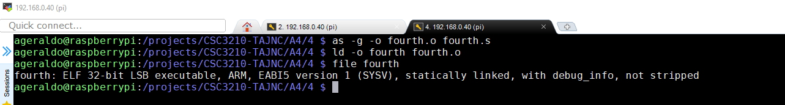

+ Invoking GNU Debugger:
    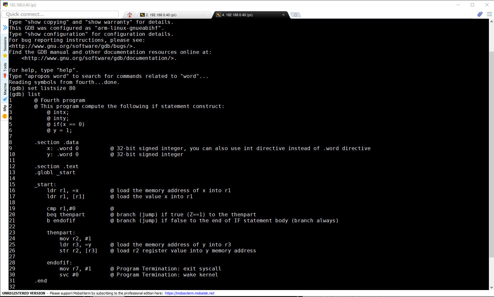

+ Adding a breaking on line 7 and executing the program:
    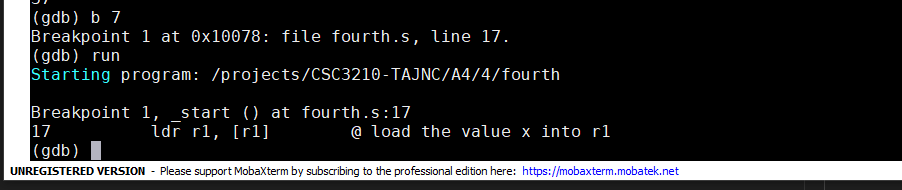

+ Examining CPSR and memory information before execution:
    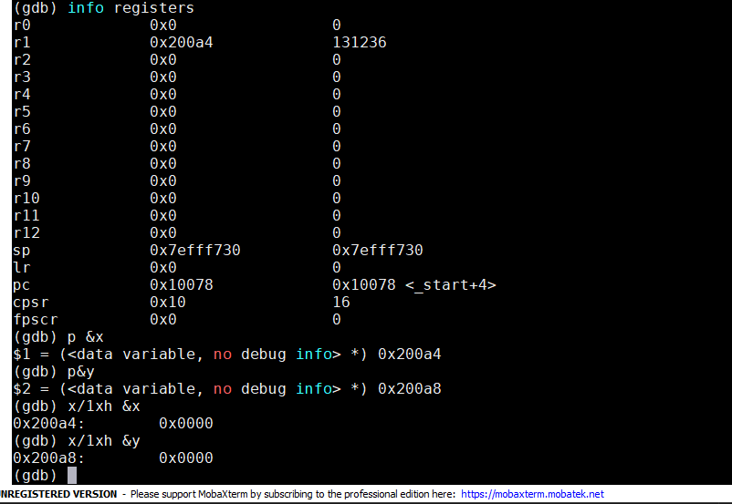 


+ Examining CPSR information after execution of CMP instruction:
    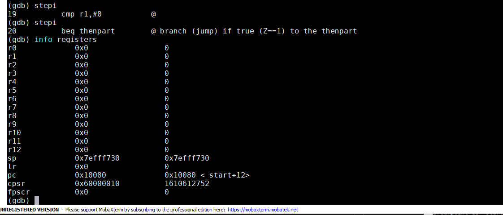

    ```
     cpsr : 0x60000010
             |_________ 0 1 1 0
                        | | | |
                        | | | |_____ overflow bit
                        | | |_______ carry bit
                        | |_________ zero bit
                        |___________ negative bit
	```

+ Examining Y value after execution of JUMP instruction:
    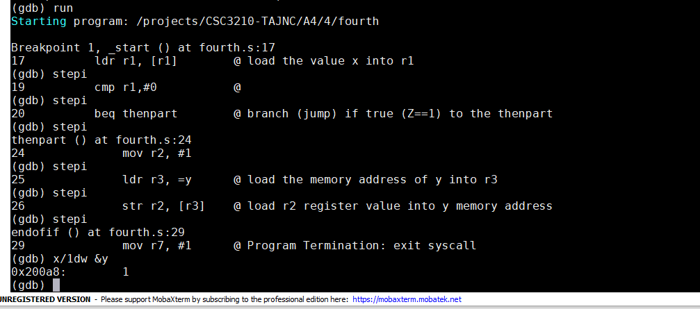

    + Y = 1d


### Part Two - Fourth_better program
___

+ Created a program called [fourth_better.s](fourth_better.s).

+ Compiling the source code:
    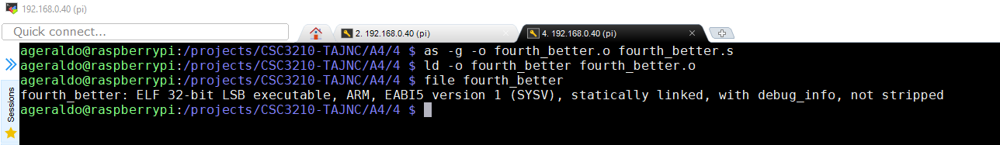

+ Invoking GNU Debugger:
    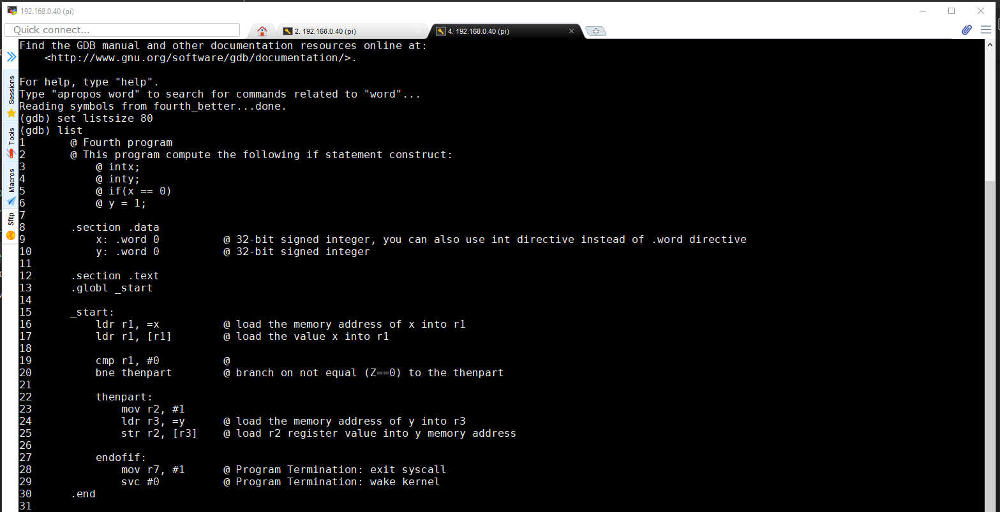

+ Adding a breaking on line 19 and executing the program:
    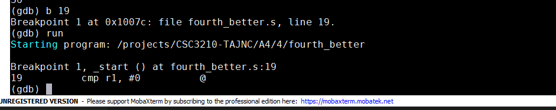

+ Examining CPSR and memory information before execution:
    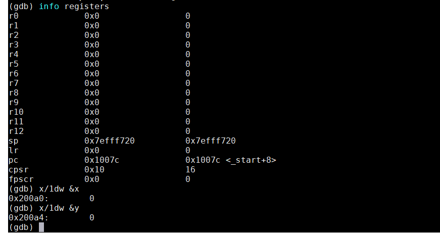 

+ Examining CPSR information after execution of CMP instruction:
    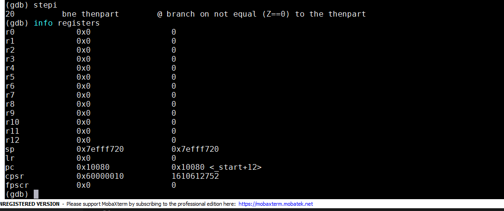

    ```
     cpsr : 0x60000010
             |_________ 0 1 1 0
                        | | | |
                        | | | |_____ overflow bit
                        | | |_______ carry bit
                        | |_________ zero bit
                        |___________ negative bit
	```    

+ Examining Y value after execution of JUMP instruction:
    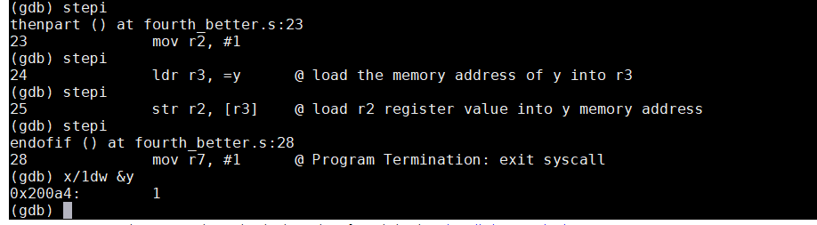

    + Y = 1d    


### Part Three - ControlStructure1 program
___

+ Created a program called [ControlStructure1.s](ControlStructure1.s).

+ Compiling the source code:
    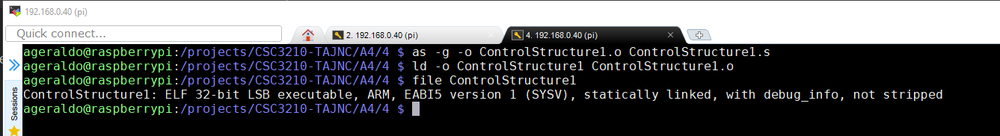

+ Invoking GNU Debugger:
    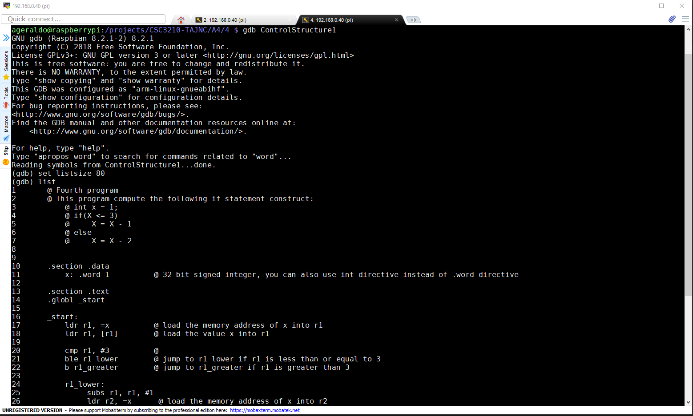

+ Adding a breaking on line 17 and executing the program:
    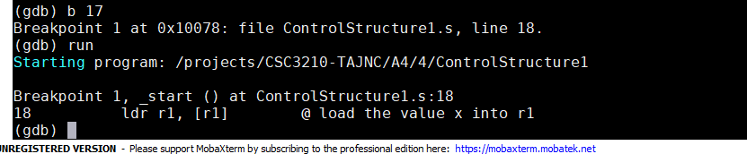

+ Examining CPSR and memory information before execution:
    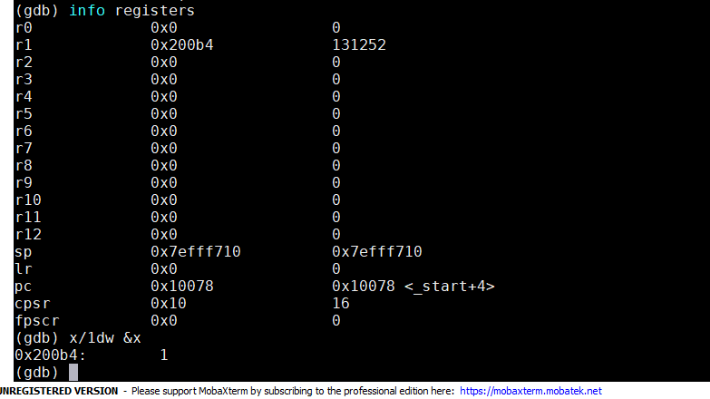 

+ Examining CPSR information after execution of CMP instruction:
    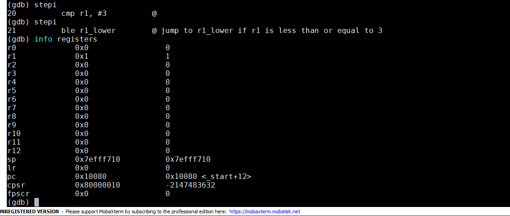

    ```
     cpsr : 0x80000010
             |_________ 1 0 0 0
                        | | | |
                        | | | |_____ overflow bit
                        | | |_______ carry bit
                        | |_________ zero bit
                        |___________ negative bit
	```    
+ Examining Y value after execution of JUMP instruction:
    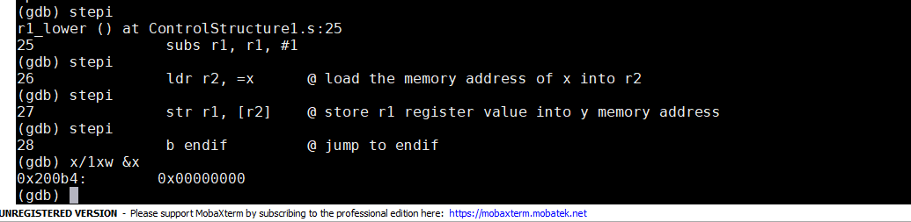

    + Y = 0h    


