## **Parallel Programming Skills**
### Drug Design and DNA in Parallel

____
### **Introduction to Parallel Programming and MapReduce**
____

+ **What are the basic steps (show all steps) in building a parallel program? Show at least one example**
    1. Identifying sets of tasks that can run concurrently.
    2. Decomposition into tasks into equal-size partitions.
    3. Orchestration: Name and data are accessed and also communicate data and also synchronization is performed among processes.
    4. Mapping: Processes are assigned to the processor.

    + **Example:**
        + Scientific computation uses parallel processing. For instance, weather predictions applications. 

+ **What is MapReduce?**
    + MapReduce is a programming model for data processing. The model is simple, yet not too simple to express useful programs in. This is actually a framework that uses to write applications in order to process large amount of data. 

+ **What is map and what is reduce?**
    + **Map:**  The map or mapper’s job is to process the input data. It takes an input pair and produces a set of intermediate key/value pairs.

    + **Reduce:** takes the input from the map and combines those data into smaller set. 

+ **Why MapReduce?**
    + Applications are scalable.

    + Applications can perform parallel processing of large amount of data.

    + Cost-effective process.

    + If your calculation can be represented by keys, values, and, aggregate operations.    

+ **Show an example for MapReduce**
    + A good example can be the Google's PageRank algorithm. PageRank algorithm computes the rank of each page in several interactions, each adjacent node can be handle by a mapper. A reducer will aggregate all data related to that specified adjacent node. The same process is applied to each node until the page rank results starting to converge. Since the amount of data used in this process cannot be stored into a single machine (big data), without using MapReduce techniques, it won't be impossible to calculate the page's rank efficiently. 

+ **Explain in your own words how MapReduce model is executed?**
    + MapReduce jobs are divided into a set of map tasks and reduce tasks that run in a distributed cluster environment. Each task works on the small subset of the data it has been assigned so that the load is spread across the cluster. The map tasks generally load, parse, transform, and filter data. Each reduces the task is responsible for handling a subset of the map task output. Each map task is broken into the following phases: record reader, mapper, combiner, and partitioner. The output of the map tasks, called the intermediate keys and values, are sent to the reducers. The reduce tasks are broken into the following phases: shuffle, sort, reducer, and output format. 

+ **List and describe three examples that are expressed as MapReduce computations.**
    
    + URL Access Frequency
        + **mappper:** processes logs of web page requests and outputs <URL, 1>. 
        + **reducer:** adds together all values for the same URL and emits a <URL, total count> pair.

    + Inverted Index
        + **mapper:** parses each document, and emits a sequence of <word, document ID> pairs.
        + **reducer:** accepts all pairs for a given word, sorts the corresponding document IDs and emits a <word, list(document ID> pair. 

    + Word Frequency
        + **mapper:** emits a <term vector> pair for each input document.
        + **reducer:** passed all per-document term vectors for a given file. It adds those term vectors together, throwing away infrequent terms, and emits a final <file, term vector> pair.

+ **When do we use OpenMP, MPI and, MapReduce (Hadoop), and why?**
    + **OpenMP:** if you want to add shared-memory parallelism to your code and if the computation problem is small enough to be performed in a single machine.

    + **MPI:** if your applications requires synchronous code and well load balanced and if the data size is moderate and the problem is computation-intensive. 

    + **MapReduce:** if the data size is large and the tasks do not require iterative processing.

+ **In your own words, explain what a Drug Design and DNA problem is in no more than 150 words.**
+ One of the main goals in designing of drugs using computational capabilities is to make sure the effectiveness of the drug remains intact. That way, the drug can be used to fight against diseases. This process starts in our bodies led by DNA. DNA contains the instructions for making proteins in our bodies. The protein's shape determines the function it performs in our bodies. By finding the correct ligand that will fit the protein and produce the desired shape change, it turns out that drugs can perform the expected results expected by pharmaceutical companies.

____

### **Parallel Programming Basics: Drug Design and DNA in Parallel**
___


+ **Compilation**
    + Transfer to Raspberry Pi [dd_serial.cpp](serial/dd_serial.cpp) and [Makefile](serial/Makefile) files.
    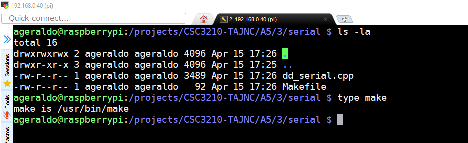

    + Compile the code
    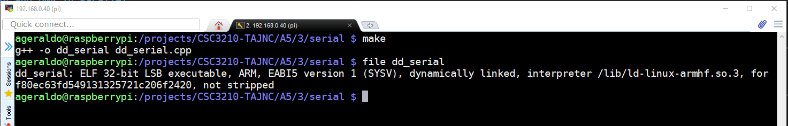
____

### **OpenMP Solution**
___    
    
+ **Compilation**
    + Transfer to Raspberry Pi [dd_omp.cpp](openMP/dd_omp.cpp) and [Makefile](openMP/Makefile) files.

    + Install Threading Building Blocks library on Raspberry Pi
    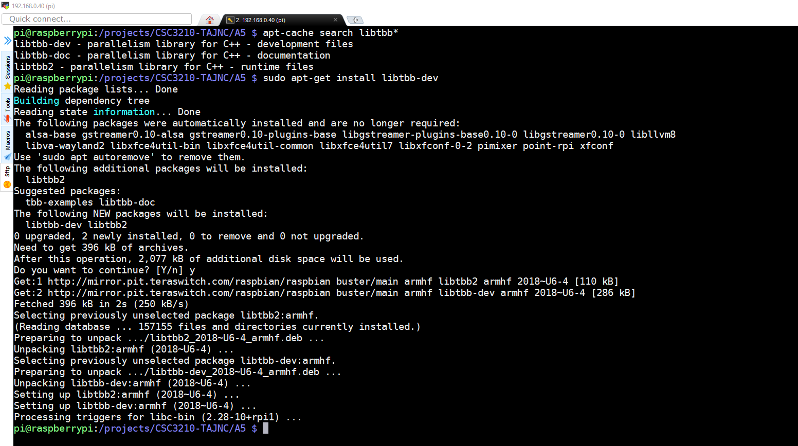

    + Compile the code
    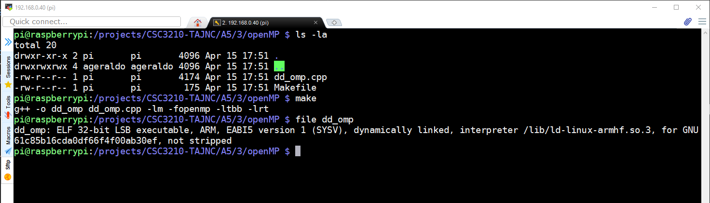

____
### **C++11 Threads Solution**
___    
    
+ **Compilation**
    + Transfer to Raspberry Pi [dd_threads.cpp](threads/dd_threads.cpp) and [Makefile](threads/Makefile) files.
    

    + Compile the code
    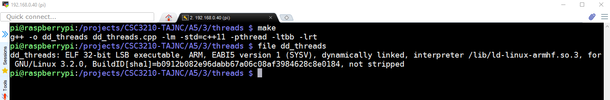

____
### **Measure Run-Time**
___

***time -p***
```
When in the POSIX locale, use the precise traditional format

    "real %f\nuser %f\nsys %f\n"

(with numbers in seconds) where the number of decimals in the output for %f is unspecified but is sufficient to express the clock tick accuracy, and at least one.
```

+ First Round
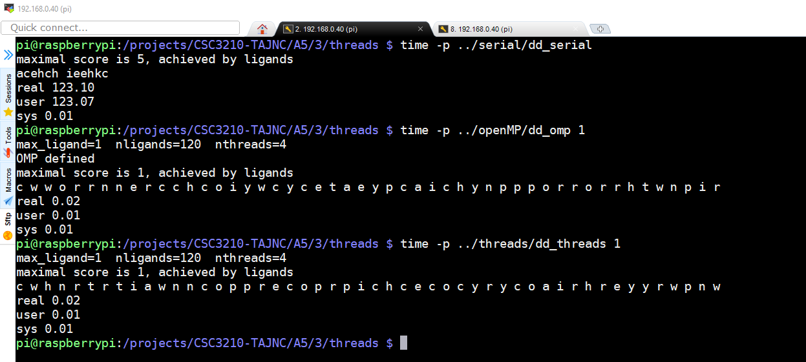


+ Results
    | Implementation | Time(s) | 
    |----------------|---------| 
    | dd_serial      | 123.10  | 
    | dd_omp         | 0.02    | 
    | dd_threads     | 0.02    | 

    **Note:** The implementation dd_serial handle the command line arguments using the following logic: 
    ```c
    #define DEFAULT_max_ligand 7
    #define DEFAULT_nligands 120
    #define DEFAULT_protein "the cat in the hat wore the hat to the cat hat party"

    int main(int argc, char **argv) {
        int max_ligand = DEFAULT_max_ligand;
        int nligands = DEFAULT_nligands;
        string protein = DEFAULT_protein;
    
        if (argc > 1)
            max_ligand = strtol(argv[1], NULL, 10);
        if (argc > 2)
            nligands = strtol(argv[2], NULL, 10);
        if (argc > 3)
            protein = argv[3];
    ```
    By not passing any argument to the program dd_serial, the default value of 7 is assigned to the maximum ligand length. For the dd_omp and dd_threads implementations, the first argument refers also to the maximum ligand length. To correct the first test (having all implementations using the same parameters), we re-execute the tests passing the number 1 as a parameter also to dd_serial.
    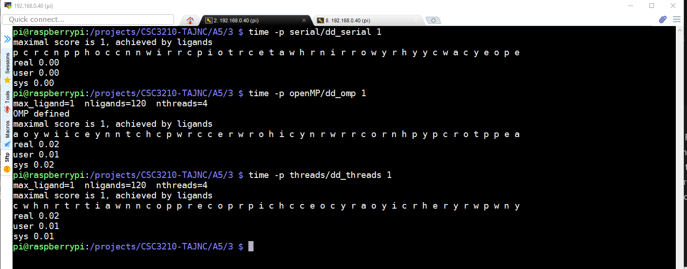

    + Results
        | Implementation | Time(s) | 
        |----------------|---------| 
        | dd_serial      | 0.00    | 
        | dd_omp         | 0.01    | 
        | dd_threads     | 0.01    | 

+ Second Round
    + First argument = 2
    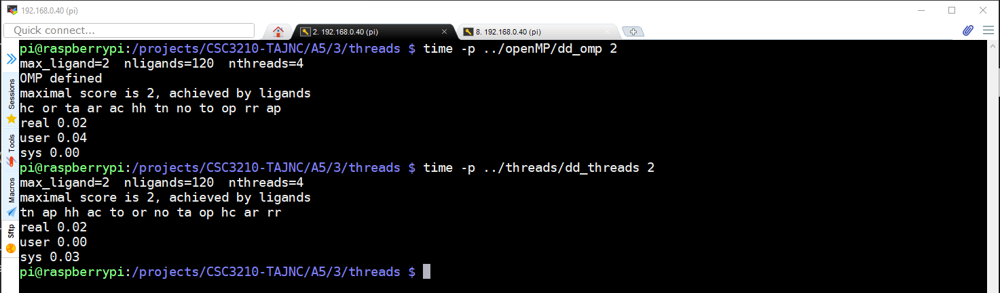

    + First argument = 3
    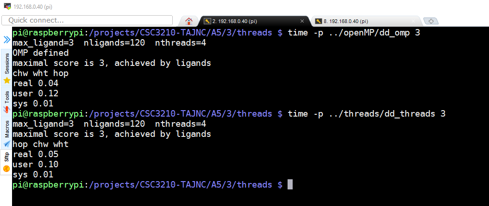

    + First argument = 4
    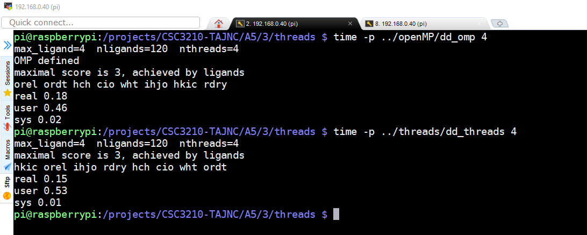

    + Results        
        | Implementation |Time(s) 2 Threads|Time(s) 3 Threads|Time(s) 4 Threads|
        |----------------|-----------------|-----------------|-----------------|
        | dd_omp         | 0.02            | 0.04            | 0.18            |
        | dd_threads     | 0.02            | 0.05            | 0.15            |

    **Note:** Again, re-executing the test passing the correct parameters to dd_omp and dd_threads (numbers of the threads is the 3 parameter):

    + Two threads
    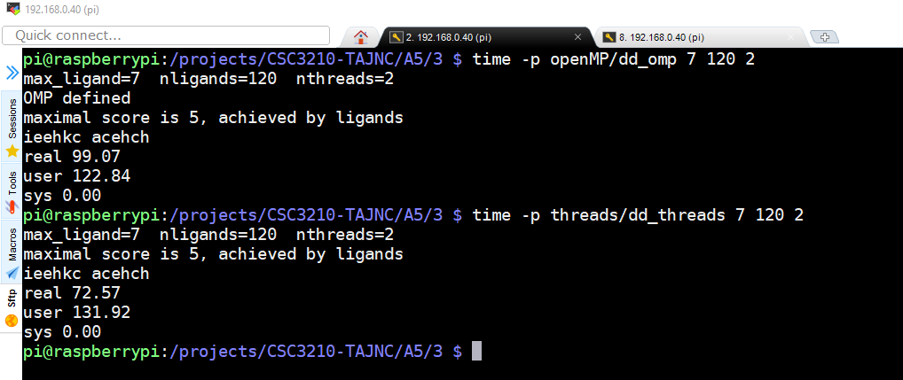

    + Three threads
    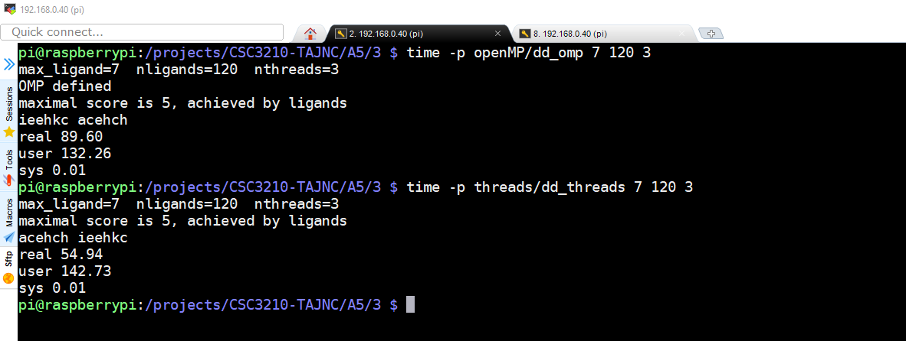

    + Four threads
    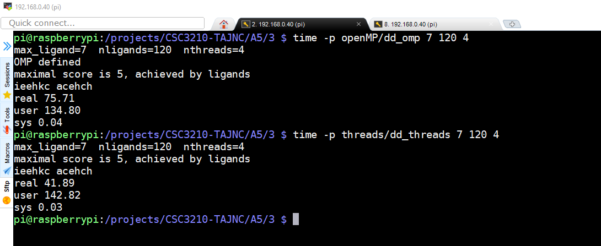

    + Results        
        | Implementation |Time(s) 2 Threads|Time(s) 3 Threads|Time(s) 4 Threads|
        |----------------|-----------------|-----------------|-----------------|
        | dd_omp         | 99.07           | 89.60           | 75.71           |
        | dd_threads     | 72.57           | 54.94           | 41.89           |


____
### **Discussion Questions**
___
**1. Which approach is the fastest?**
+ Based on measurement results the implementation using C++11 is the fastest implementation. As the number of threads was increased, the response time decreased. Below the difference in response time for OpenMP and C++11 implementation (dd_serial does not implement parallel computing) :

    + Results        
        | Implementation |Time(s) 2 Threads|Time(s) 3 Threads|Time(s) 4 Threads|
        |----------------|-----------------|-----------------|-----------------|
        | dd_threads     | 31% faster      | 35% faster      | 34% faster      |

**2. Determine the number of lines in each file (use wc -l). How does the C++11 implementation compare to the OpenMP implementations?**
+ Number of lines:
    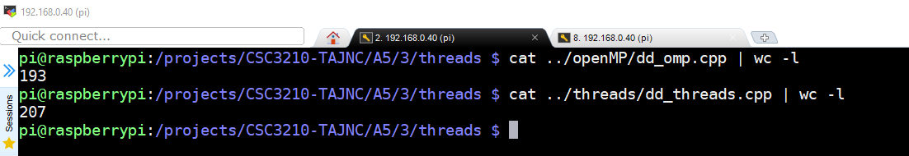

+ OpenMP implicity manage thread team versus C++11 is managing the threads team explicitly.
    + Map Implementation differences
    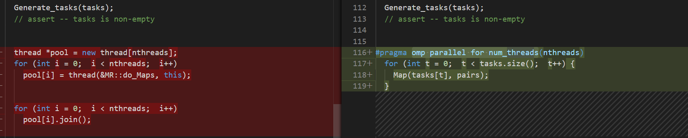 

    + Generate Tasks Implementation differences
    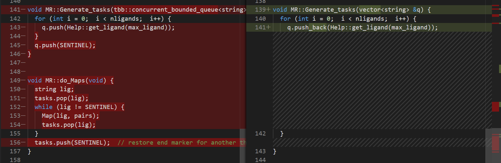


**3. Increase the number of threads to 5 threads. What is the run time for each?**
+ 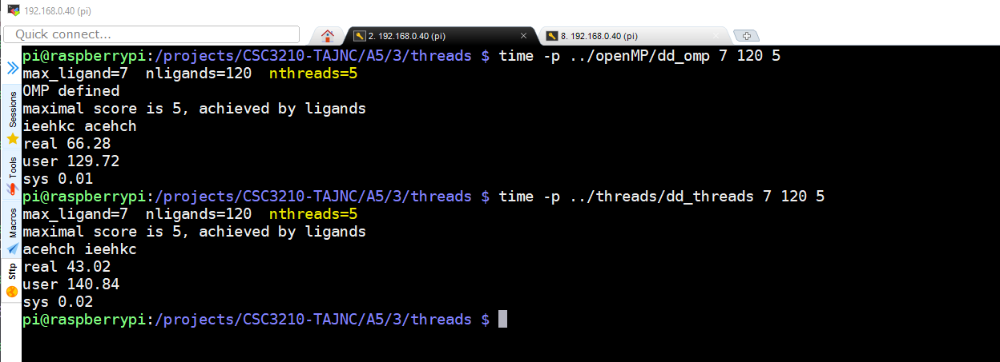

+ Results
    | Implementation | Time(s) | 
    |----------------|---------| 
    | dd_omp         | 66.28   | 
    | dd_threads     | 43.02   | 


**4. Increase the maximum ligand length to 7, and rerun each program. What is the run time for each?**
+ 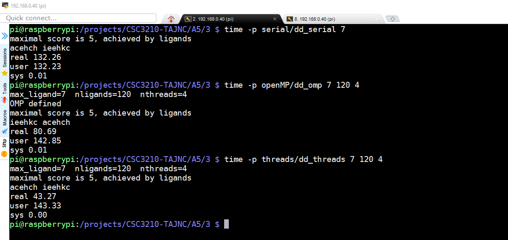

+ Results
    | Implementation | Time(s) | 
    |----------------|---------| 
    | dd_serial      | 132.26  |
    | dd_omp         | 80.69   | 
    | dd_threads     | 43.27   | 


